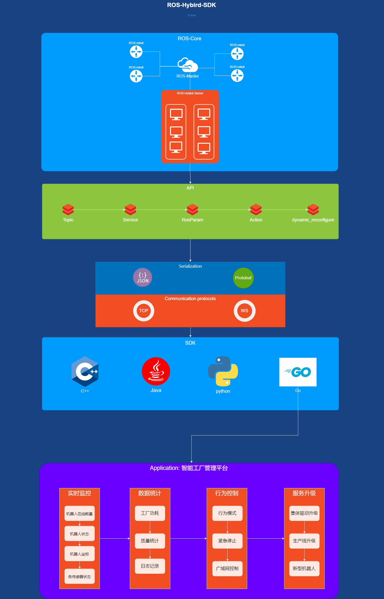

# ros_hybrid_sdk
This package contains the ROS Hybrid SDK, 
which is a set of tools to help you develop ROS applications without officially supported ROS distributions.

 
 
This response includes ros_hybrid_server, ros_hybrid_protoc.

## ros_hybrid_server
ros_hybrid_server is a reverse proxy service that translates ros_hybrid_sdk message to ROS system.

## ros_hybrid_protoc
ros_hybrid_protoc is a tool to generate code for translate ros_hybrid_sdk message to ROS system.

## build
1. Install a ROS distribution.
2. create a catkin workspace.
3. clone this repository to the src directory of the catkin workspace.
4. run `catkin_make` in the catkin workspace.

## usage
1. run `roscore` in the ROS system.
2. run `rosrun ros_hybrid_sdk ros_hybrid_server` in the ROS system.
3. run some ros_hybrid_sdk applications.